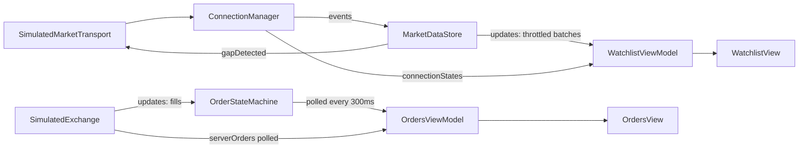

# Exchange24-iOS (iOS demo app)

The demo app for [Exchange24Kit](../Exchange24Kit): a trading-app UI
built on top of its real-time market data and order-integrity modules.
This repo is the consumer — all the hard logic (WebSocket lifecycle,
snapshot+delta merge, conflation, order state machine, idempotency)
lives in Exchange24Kit. This repo is composition, UI, and demo controls
only.

Status: Watchlist + Orders screens wired. See [Roadmap](#roadmap).

## Table of Contents
- [Architecture](#architecture)
- [Running this app](#running-this-app)
- [Dependency on Exchange24Kit](#dependency-on-exchange24kit)
- [Roadmap](#roadmap)

## Architecture

`AppEnvironment` is the composition root — the only file in this repo
that knows concrete types (`SimulatedMarketTransport`,
`SimulatedExchange`). Every screen downstream only talks to
Exchange24Kit's protocols and actors.

Auto-resync is event-driven, not polled: `AppEnvironment` already
forwards every event into `MarketDataStore.ingest(_:)` and reads back
its `MergeOutcome` — the moment that outcome is `.gapDetected`, it calls
`transport.sendSnapshot()` immediately.

`simulateRestart()` rebuilds `ConnectionManager`, `MarketDataStore`, and
`OrderStateMachine` from nothing, but keeps the same `InMemoryOrderStore`
instance — mirroring what a real app's on-disk persistence would survive
across a kill — then calls `OrderStateMachine.recoverAll()`. It also
bumps `AppEnvironment.generation`, which `App.swift` uses via
`.id(environment.generation)` to force every screen's view model to
rebuild against the fresh actors; without that, screens already on
screen would keep talking to the actors from before the simulated kill.

Two known Kit limitations surfaced while wiring the UI, both documented
in code where they matter: `ConnectionManager.connectionStates()` and
`SimulatedExchange.updates()` each support only one subscriber at a time
(calling either a second time silently steals the first subscriber's
continuation) — `WatchlistViewModel` owns the former, `AppEnvironment`'s
fill-forwarding loop owns the latter, and `OrdersViewModel` works around
it by polling instead of subscribing again.

## Running this app

This is a standard Xcode project.

1. Open `Exchange24.xcodeproj`.
2. Xcode resolves the `Exchange24Kit` Swift Package dependency
   automatically (Package Dependencies tab in the project settings).
3. Pick an iOS Simulator as the run destination.
4. Run (⌘R).

## Dependency on Exchange24Kit

Added via Xcode's Package Dependencies (project settings → Package
Dependencies → +), pointing at: https://github.com/enjelhutasoit-com/exchange24-kit

For local development with both repos checked out side by side, Xcode
also supports adding a local package dependency instead (Add Local...,
pointing at the `Exchange24Kit` folder) — swap between the two from the
same Package Dependencies panel, no code changes needed either way.

## Roadmap

- [x] Composition root: SimulatedMarketTransport -> ConnectionManager -> MarketDataStore
- [x] Composition root: SimulatedExchange -> OrderStateMachine, fills wired
- [x] Event-driven auto-resync on gap detection
- [x] simulateRestart() exercising OrderStateMachine.recoverAll(), with proper view-model rebuild
- [x] Watchlist screen: live ticking list, throughput/conflation stats, connection status
- [x] Orders screen: place/cancel/reconcile orders, sabotage controls, server-truth panel
- [ ] Give OrderStateMachine and ConnectionManager real multi-subscriber broadcast streams,
      removing the two polling workarounds noted above
- [ ] Unit tests for WatchlistViewModel / OrdersViewModel (inject fake actors, assert @Published state)
- [ ] App icon, launch screen, proper bundle identifier for a real device build
